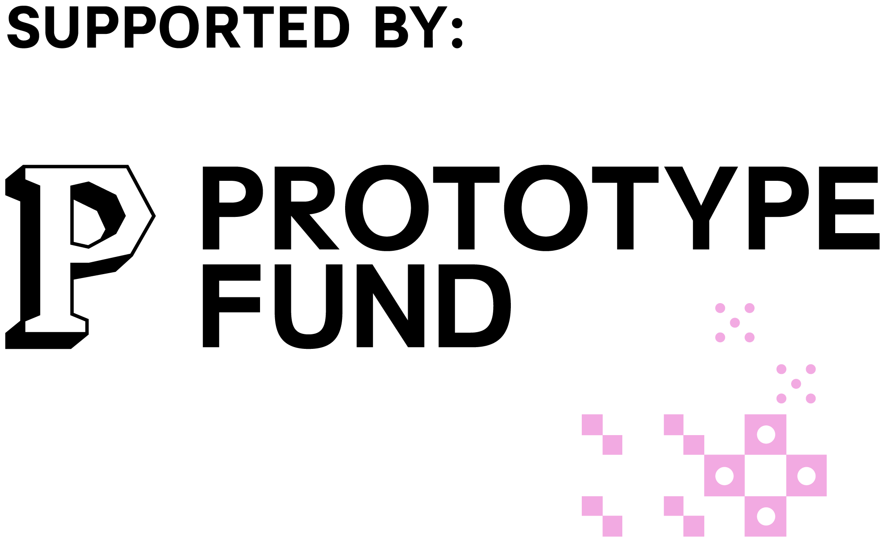

[](https://github.com/mloda-ai/mloda-plugin-govdata/blob/main/LICENSE)
[](https://github.com/mloda-ai/mloda)
[](https://www.python.org/)
[](https://github.com/mloda-ai/mloda-plugin-govdata/actions/workflows/test.yml?query=branch%3Amain)
[](https://prototypefund.de)

# mloda-plugin-govdata

Connectors for German open government data, built on [mloda](https://github.com/mloda-ai/mloda). Request the columns you want as mloda features; the plugin handles CKAN discovery, download with caching and retries, and parsing (German CSV or publisher JSON) into a typed Arrow table.

Three example datasets cover the M1 themes: population (GovData CSV), elections (Bundeswahlleiterin `kerg.csv`), and environment (UBA Air Data JSON).

## Usage

Read the Stuttgart population dataset (via GovData) as a typed PyArrow table:

```python
from mloda.user import Feature, mloda
from mloda_plugin_govdata.feature_groups.govdata import GovDataReader

slug = "einwohner-nach-altersgruppen-und-stadtbezirken"
result = mloda.run_all(
    [
        Feature("Einwohner", options={GovDataReader.__name__: slug}),
        Feature("Stadtbezirk", options={GovDataReader.__name__: slug}),
    ],
    compute_frameworks=["PyArrowTable"],
)
table = result[0]  # pyarrow.Table with the requested columns
```

The option value is a GovData dataset slug or a direct distribution URL. The license is read from the CKAN distribution metadata. Set `GovDataReader.cache_dir` to control where downloads are cached.

Don't know the slug yet? Search GovData with the paginated CKAN `package_search` API:

```python
from mloda_plugin_govdata.feature_groups.govdata import search_datasets
from mloda_plugin_govdata.feature_groups.govdata.client import build_client

with build_client() as client:
    for dataset in search_datasets(client, "einwohner stuttgart", max_results=10):
        print(dataset.name, "|", dataset.title)
```

`search_datasets` walks the result pages lazily (`page_size` per request) and stops at `max_results` or the end of the result set.

The elections reader handles a direct CSV URL whose file has a multi-row merged header (Bundeswahlleiterin `kerg.csv`):

```python
from mloda_plugin_govdata.feature_groups.govdata import BundeswahlleiterinReader

kerg = "https://www.bundeswahlleiterin.de/bundestagswahlen/2025/ergebnisse/opendata/btw25/csv/kerg.csv"
result = mloda.run_all(
    [Feature("Gebiet", options={BundeswahlleiterinReader.__name__: kerg})],
    compute_frameworks=["PyArrowTable"],
)
```

The environment reader fetches the Umweltbundesamt (UBA) Air Data v4 `measures` endpoint (REST JSON) and flattens it to one typed row per station and timestamp. `uba_measures_url` builds the query (here: hourly ozone at station 143):

```python
from mloda_plugin_govdata.feature_groups.govdata import UbaAirReader, uba_measures_url

url = uba_measures_url(station=143, component=3, scope=2, date_from="2025-01-01", date_to="2025-01-01")
result = mloda.run_all(
    [
        Feature("date_start", options={UbaAirReader.__name__: url}),
        Feature("value", options={UbaAirReader.__name__: url}),
    ],
    compute_frameworks=["PyArrowTable"],
)
```

Columns are `station_id`, `date_start`, `component_id`, `scope_id`, `value`, `date_end`, and `index` (the air-quality index). Component and scope ids come from the UBA `components` and `scopes` endpoints.

## Demo

An interactive [marimo](https://marimo.io) notebook walks through dataset discovery and all three example datasets:

```bash
uv sync --all-extras
uv run marimo edit demos/govdata_demo.py
```

The notebook hits the live GovData, Bundeswahlleiterin, and UBA endpoints; downloads are cached locally after the first run.

## Related Repositories

- **[mloda](https://github.com/mloda-ai/mloda)**: The core library for open data access. Declaratively define what data you need, not how to get it. mloda handles feature resolution, dependency management, and compute framework abstraction automatically.

- **[mloda-registry](https://github.com/mloda-ai/mloda-registry)**: The central hub for discovering and sharing mloda plugins. Browse community-contributed FeatureGroups, find integration guides, and publish your own plugins for others to use.

## Funding

Developed as part of the [Prototype Fund](https://prototypefund.de) (Round 2 / Jahrgang 02), funded by the German Federal Ministry of Research, Technology and Space (BMFTR) and supported by the [Open Knowledge Foundation Deutschland](https://okfn.de). Funding code (Förderkennzeichen): **16IS26S11**. Stage 1 funding period: 6 months from June 2026.

<p>
  
  &nbsp;&nbsp;&nbsp;
  
</p>

